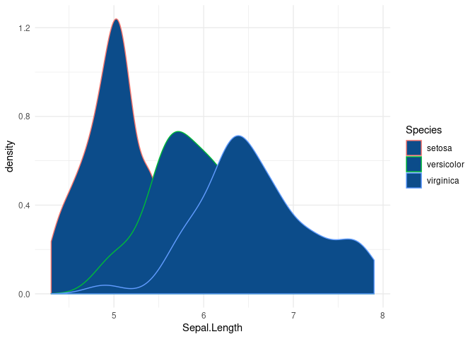
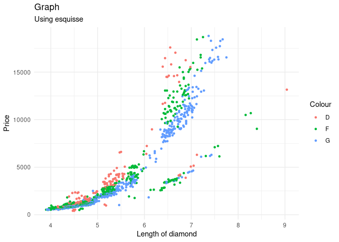
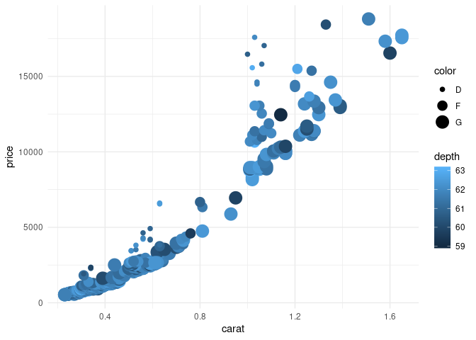
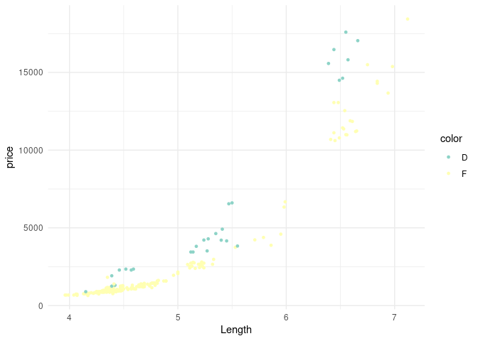

Esquisse
================
Gemma Kirkham
10/27/2019

First, we want to install and load esquisse into R ready to use.

``` r
#install.packages("esquisse")
library(esquisse)
library(tidyverse)
```

    ## ── Attaching packages ────────────────────────────────────────────────────────────────────────────────────────────────────────────────── tidyverse 1.2.1 ──

    ## ✔ ggplot2 3.2.1     ✔ purrr   0.3.2
    ## ✔ tibble  2.1.3     ✔ dplyr   0.8.3
    ## ✔ tidyr   1.0.0     ✔ stringr 1.4.0
    ## ✔ readr   1.3.1     ✔ forcats 0.4.0

    ## ── Conflicts ───────────────────────────────────────────────────────────────────────────────────────────────────────────────────── tidyverse_conflicts() ──
    ## ✖ dplyr::filter() masks stats::filter()
    ## ✖ dplyr::lag()    masks stats::lag()

We are also going to use the diamonds dataset from the ggplot2 package.
Ensure that this is also loaded before continuing. This also allows you
to see what kind of data you are handling.

``` r
#diamonds
#iris
```

Obviously diamonds is a pretty large dataset and it may be hard to
recognise what you want to show on a graph and whether you want to
select certain parts of the data to use. There are two ways of accessing
the esquisse library. We can either use the command below or we go to
Addins menu and select ‘ggplot2’ builder under Esquisse. This will bring
up a window where you can select your data.frame and what variables you
would like in your plot. It also tells you what type of variables they
are.

``` r
esquisse::esquisser(diamonds)
esquisse::esquisser(iris)
```

``` r
ggplot(iris) +
 aes(x = Sepal.Length, colour = Species) +
 geom_density(adjust = 1L, fill = "#0c4c8a") +
 scale_color_hue() +
 theme_minimal()
```

<!-- -->

``` r
diamonds <- diamonds %>% 
 filter(cut %in% "Ideal") %>%
 filter(color %in% c("F", "G", "D")) %>%
 
    filter(clarity %in% c("VVS1", "I1", "IF")) %>%
 filter(depth >= 52L & depth <= 
    79L) %>%
 filter(x >= 2.7 & x <= 10.8)

ggplot(diamonds) +
 aes(x = x, y = price, colour = color) +
 geom_point(size = 1L) +
 scale_color_hue() +
 labs(x = "Length of diamond", y = "Price", title = "Graph", subtitle = "Using esquisse", color = "Colour") +
 theme_minimal()
```

<!-- -->

``` r
diamonds <- diamonds %>%
 filter(cut %in% "Ideal") %>%
 filter(clarity %in% "IF")

ggplot(diamonds) +
 aes(x = carat, y = price, colour = depth, size = color) +
 geom_point() +
 scale_color_gradient() +
 theme_minimal()
```

<!-- -->

``` r
diamonds <- diamonds %>%
 filter(cut %in% "Ideal") %>%
 filter(!(color %in% c("E", "H", "G"))) %>%
 
    filter(clarity %in% c("SI2", "VVS1", "I1", "IF")) %>%
 filter(depth >= 43L & depth <= 
    73L)

ggplot(diamonds) +
 aes(x = x, y = price, colour = color) +
 geom_point(size = 1L) +
 scale_color_brewer(palette = "Set3") +
 labs(x = "Length") +
 theme_minimal()
```

<!-- -->
